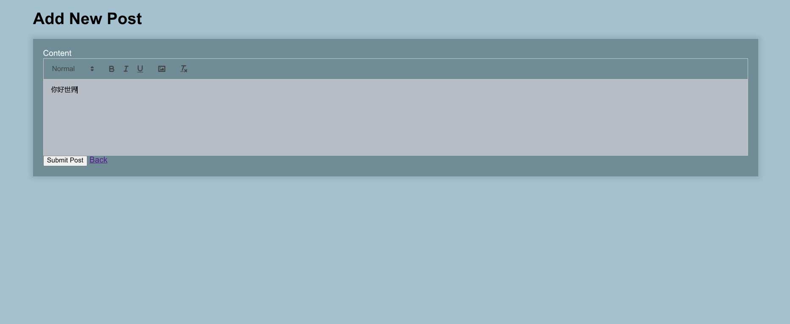
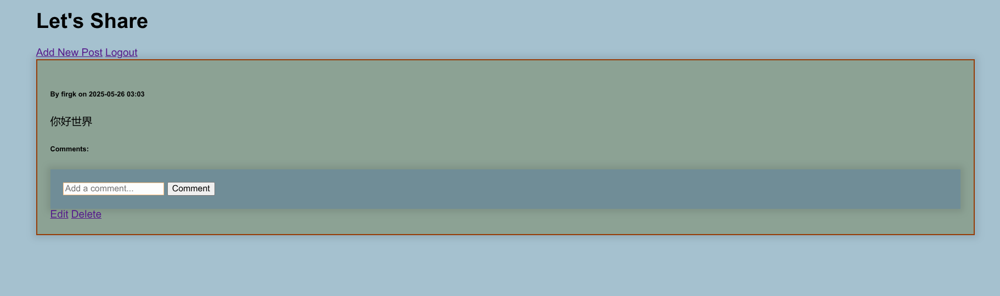
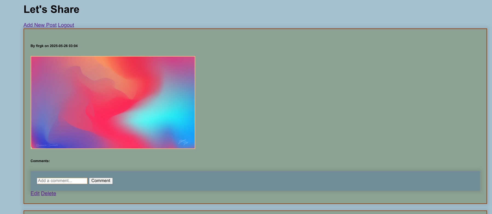

## simple_zone


轻量的个人空间网站，类似朋友圈或qq空间，使用 python 和 flask


## 展示






## 使用

git clone https://github.com/firgk/simple_zone.git


修改 app.py 中的 加密密钥 和 账号密码
```
app.config['SECRET_KEY'] = 'mjqqsssaaawwwkwwwss' # 加密密钥
和
email = 'firgk'
password = 'yourpassword'
```

修改 login.py 中的 默认填充
```
<input type="text" class="form-control" name="email"  value="你可以修改默认填充"  required >
```

pip install -r requestments

python app.py


## 其他

reference from https://github.com/chirag1981/simple_blog